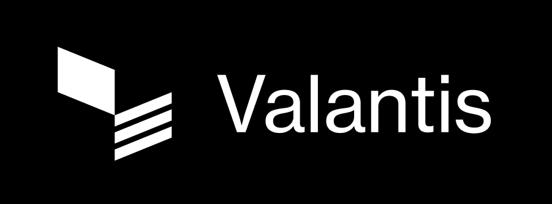

## Valantis Stake Exchange AMM (STEX AMM)

STEX AMM is a novel AMM uniquely designed for redeemable assets such as Liquid Staking Tokens (LSTs), designed in collaboration with [Thunderhead](https://thunderhead.xyz/).

LSTs are backed 1:1 by an equivalent amount of native asset (in the absence of slashing). However, generic AMMs fail to account for this simple fact, forcing LPs to sell the LST for less than fair value, resulting in significant cumulative losses to arbitrageurs. Moreover, there are times where excess liquidity can be put to earn extra yield on external protocols (e.g. lending markets like AAVE and Euler) and only be brought back into the AMM if needed to absorb incoming swap volume.

STEX AMM solves these two structural inefficiencies by integrating with the LST's protocol native withdrawal queue, hence converting any desired about of LST back into native token at 1:1 rate after a waiting period (e.g. 1-7 days on HyperEVM). Moreover, a portion of native token's unused reserves can be put to earn yield on a lending market. Swap fees are dynamic, going as low as 1 basis-point, and growing higher depending on how congested the LST protocol's withdrawal queue is, providing attractive exchange rates for swaps with clearly defined pricing bounds.

- [Docs](https://docs.valantis.xyz/staked-amm)
- [Whitepaper](https://github.com/ValantisLabs/stex-amm-whitepaper/blob/main/STEX_AMM_WHITEPAPER.pdf)

## Folder structure description

### src/

Contains STEX AMM's core contracts, Module dependencies and Mock contracts used for testing.

**AaveLendingModule.sol**: This is a dedicated module, compatible with AAVE V3's `supply` and `withdraw` functions. Its owner can deposit and withdraw a portion of Wrapped Native Token's pool reserves, with the goal of optimizing overall yield.

**STEXAMM.sol**: The main contract which implements the core mechanisms of STEX AMM, built as a Valantis [Liquidity Module](https://docs.valantis.xyz/sovereign-pool-subpages/modules/liquidity-module).

**STEXLens.sol**: Helper contract that contains read-only functions which are useful to simulate state updates in `STEXAMM`.

**STEXRatioSwapFeeModule.sol**: Contains a dynamic fee mechanism for swaps on STEX AMM, built as a Valantis [Swap Fee Module](https://docs.valantis.xyz/sovereign-pool-subpages/modules/swap-fee-module).

**stHYPEWithdrawalModule.sol**: Module that manages all of STEX AMM's interactions with [stakedHYPE](https://www.stakedhype.fi/), a leading LST protocol on HyperEVM developed by [Thunderhead](https://thunderhead.xyz/).

**owner/WithdrawalModuleManager.sol\***: Custom contract that has the `owner` role in `stHYPEWithdrawalModule`. It is controlled by a multi-sig.

**owner/WithdrawalModuleKeeper.sol**: A sub-role in `WithdrawalModuleManager`, executing smart contract calls that require automation but which are not mission critical.

**interfaces/**: Contains all relevant interfaces.

**structs/**: Contains all relevant structs.

**mocks/**: Contains mock contracts required for testing.

### test/

Contains the foundry tests.

### scripts/

Contains the scripts to deploy STEX AMM and all its respective module dependencies, execute swaps, deposits or withdrawals, and update specific parameters of the modules.

## Usage

### Build

```shell
$ forge build
```

### Test

```shell
$ forge test
```

### Test coverage

```shell
$ bash coverage.sh
```

### Deploy

Copy .env.example file to .env and set the variables.

**Note:** All deployment bash scripts are, by default, in simulation mode. Add `--broadcast` flag to trigger deployments, and `--verify` for block explorer contract verification.

### License

Stake Exchange AMM is licensed under the Business Source License 1.1 (BUSL-1.1), see [BUSL_LICENSE](licenses/BUSL_LICENSE), and the MIT Licence (MIT), see [MIT_LICENSE](licenses/MIT_LICENSE). Each file in Stake Exhange AMM states the applicable license type in the header.
