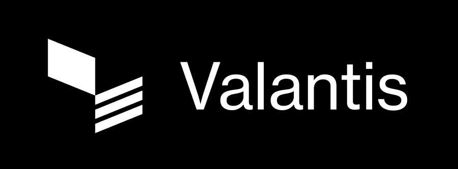

## Valantis Stake Exchange AMM (STEX AMM)

STEX AMM is a novel AMM uniquely designed for yield-bearing assets which are redeemable for their underlying, such as Liquid Staking Tokens (LSTs), designed in collaboration with [Thunderhead](https://thunderhead.xyz/).

LSTs are backed 1:1 by an equivalent amount of native asset (in the absence of slashing). However, generic AMMs fail to account for this simple fact, forcing LPs to sell the LST for less than fair value, resulting in significant cumulative losses to arbitrageurs. Moreover, there are times where excess liquidity can be put to earn extra yield on external protocols (e.g. lending markets like AAVE and Euler) and only be brought back into the AMM if needed to absorb incoming swap volume.

STEX AMM solves these two structural inefficiencies by integrating with the LST's protocol native withdrawal queue, hence converting any desired about of LST back into native token at 1:1 rate after a waiting period (e.g. 1-7 days on HyperEVM). Moreover, a portion of native token's unused reserves can be put to earn yield on a lending market. Swap fees are dynamic, going as low as 1 basis-point, and growing higher depending on how congested the LST protocol's withdrawal queue is, providing attractive exchange rates for swaps with clearly defined pricing bounds.

- [Docs](https://docs.valantis.xyz/staked-amm)
- [Whitepaper](https://github.com/ValantisLabs/stex-amm-whitepaper/blob/main/STEX_AMM_WHITEPAPER.pdf)

## Folder structure description

### src/

Contains STEX AMM's core contracts, Module dependencies and Mock contracts used for testing.

**AaveLendingModule.sol**: Dedicated Lending Module compatible with AAVE V3's `supply` and `withdraw` functions. Its owner can deposit and withdraw a portion of pool's `token1` reserves, with the goal of optimizing overall yield.

**ERC4626LendingModule.sol**: Dedicated Lending Module compatible with ERC4626 standard vaults. Its owner can deposit and withdraw a portion of pool's `token1` reserves, with the goal of optimizing overall yield.

**MultiMarketLendingModule.sol**: Lending Module which can deposit and withdraw an asset across multiple Lending Modules, such as `AaveLendingModule` and `ERC4626LendingModule`.

**STEXAMM.sol**: The main contract which implements the core mechanisms of STEX AMM, built as a Valantis [Liquidity Module](https://docs.valantis.xyz/sovereign-pool-subpages/modules/liquidity-module).

**STEXLens.sol**: Helper contract that contains read-only functions which are useful to simulate state updates in `STEXAMM`. WARNING: Only compatible with `stHYPEWithdrawalModule` and `kHYPEWithdrawalModule`.

**STEXRatioSwapFeeModule.sol**: Contains a dynamic fee mechanism for swaps on STEX AMM, based on the ratio of reserves between the LST and wrapped native token, built as a Valantis [Swap Fee Module](https://docs.valantis.xyz/sovereign-pool-subpages/modules/swap-fee-module).

**StepwiseFeeModule.sol**: Contains a dynamic fee mechanism for swaps on STEX AMM, using a stepwise function pricing curve whose shape can be determined off-chain using sophisticated models and pricing information, built as a Valantis [Swap Fee Module](https://docs.valantis.xyz/sovereign-pool-subpages/modules/swap-fee-module).

**stHYPEWithdrawalModule.sol**: Module that manages all of STEX AMM's interactions with [stakedHYPE](https://www.stakedhype.fi/), a leading LST protocol on HyperEVM developed by [Thunderhead](https://thunderhead.xyz/).

**kHYPEWithdrawalModule.sol**: Module that manages all of STEX AMM's interactions with [kHYPE](https://kinetiq.xyz/), a leading LST protocol on HyperEVM developed by [Kinetiq](https://kinetiq.xyz/).

**owner/stHYPEWithdrawalModuleManager.sol**: Custom contract that has the `owner` role in `stHYPEWithdrawalModule`. It is controlled by a multi-sig.

**owner/stHYPEWithdrawalModuleKeeper.sol**: A sub-role in `stHYPEWithdrawalModuleManager`, executing smart contract calls that require automation but which are not mission critical.

**owner/kHYPEWithdrawalModuleManager.sol**: Custom contract that has the `owner` role in `kHYPEWithdrawalModule`. It is controlled by a multi-sig.

**owner/kHYPEWithdrawalModuleKeeper.sol**: A sub-role in `kHYPEWithdrawalModuleManager`, executing smart contract calls that require automation but which are not mission critical.

**owner/StepwiseFeeModuleKeeper.sol**: A sub-role in `StepwiseFeeModule`, setting and updating dynamic fee parameters.

**interfaces/**: Contains all relevant interfaces.

**structs/**: Contains all relevant structs.

**mocks/**: Contains mock contracts required for testing.

### test/

Contains the foundry tests.

### scripts/

Contains the scripts to deploy STEX AMM and all its respective module dependencies, execute swaps, deposits or withdrawals, and update specific parameters of the modules.

## Usage

### Build

```shell
$ forge build
```

### Test

```shell
$ forge test
```

### Test coverage

```shell
$ bash coverage.sh
```

### Deploy

Copy .env.example file to .env and set the variables.

**Note:** All deployment bash scripts are, by default, in simulation mode. Add `--broadcast` flag to trigger deployments, and `--verify` for block explorer contract verification.

### Risks and Trust Assumptions: kHYPEWithdrawalModule

**Owner role in kHYPEWithdrawalModule**

Role:

- Can update the `Lending Module` under 3-7 day timelock.
- Can send any amount of token1 to the `Lending Module`'s deposit function.
- Can withdraw any amount of token1 from the `Lending Module`'s withdraw function and send it to `pool`.
- Can unstake the `pool`'s entire token0 balance to the kHYPE `StakingManager` queueWithdrawal function, queuing for withdrawal with `kHYPEWithdrawalModule` being the recipient.
- Can stake the `pool`'s entire token1 balance to the kHYPE `StakingManager` stake function, with the pool being the recipient.
- Can atomically rebalance the `pool`'s token0 reserves into token1, as long as the cost of rebalance does not exceed the fee which would be paid by unstaking through `StakingManager`
- Can use liquid token1 reserves in the `pool` to net off against pending LP withdrawals, delivering faster LP withdrawals whenever available.
- Can rescue any locked tokens which are not the native token, token0 nor token1.
- Can unstake any surplus balance of token0 to the kHYPE `StakingManager` queueWithdrawal function. This can happen in case of donations or cancelled unstaking operations by `StakingManager`.

Risks:

- `owner` can steal token1 reserves with a minimum 3-day timelock by upgrading the `Lending Module` to a malicious contract. Currently the `owner` role is managed by a trusted multi-sig.
- Due to the fact that Kinetiq protocol can update unstaking fees, and unstaking of token0 reserves is managed by `owner` and is separate from the LP's withdrawal initiation, there can be a mismatch between the amount of HYPE which the LP expects to receive vs. what is actually returned after unstaking is processed. `owner` is trusted to quickly unstake after LPs initiate withdrawal requests and to pay attention to any sudden changes in Kinetiq's unstaking fee, in order to minimize such discrepancies.

**Lending Module in kHYPEWithdrawalModule**

The integrated lending protocol in `Lending Module` custodies a portion of token1 reserves determined by `owner`.
For example, `AAVELendingModule` contract provides a concrete implementation compatible with AAVE V3 deployments.

Risks:

- If the integrated lending protocol becomes insolvent or contains faulty withdrawal logic, funds will be lost.
- If the integrated lending protocol is working correctly but does not have enough liquidity to honor instant withdrawals, then LP withdrawals via `STEX AMM` withdraw function would become temporarily blocked. In this scenario, the user is expected to withdraw at a later stage.
- It is assumed that the lending protocol's deposit function does not allow for partially deposited amounts. If that is the case, `Lending Module` would need to handle refunds of unused token amounts back into the pool.

**Kinetiq Protocol Risks and Assumptions:** kHYPE AMM integrates with the `StakingManager` contract for token0 (kHYPE) withdrawals, and `StakingAccountant` for reading exchange rates between kHYPE and HYPE. kHYPE AMM allows the external custody of up to 100% of the AMM's token0 reserves as Pending Withdrawals. `StakingManager` and `Staking Accountant` are upgradable, and kHYPE AMM trusts the management of Kinetiq protocol to manage its kHYPE assets for delayed redemption at its true rate.

This codebase is currently intended to deployed on Hyperliquid's HyperEVM, where slashing is not active. This is why the kHYPEWithdrawalModule contract always assumes that `StakingManager` will honor kHYPE withdrawal requests amount at 1:1 rate against Native Token, excluding the fee paid in kHYPE at the time where unstaking is initiated.

**Slashing Risk:**

kHYPE AMM protects against secondary-market depeg arbitrage loss by never selling kHYPE below the true peg (determined by `StakingAccountant` contract). kHYPE reserves in the AMM are exposed to real slashing events in the same way as holding kHYPE directly. The risk is only based on the current kHYPE reserves of the pool at the time of slashing, and does not create further arbitrage loss. Currently, Hyperliquid does not have slashing enabled.

**Inventory Risk**

An LP position can consist of HYPE, kHYPE, and pending kHYPE withdrawals. Upon withdrawing the LP position, a user may withdraw their illiquid portion of pending kHYPE Withdrawals instantly for a fee. In the case of pending withdrawals, to be given the full value of their position, the user must wait until maturity of their pending withdrawal.

### License

Stake Exchange AMM is licensed under the Business Source License 1.1 (BUSL-1.1), see [BUSL_LICENSE](licenses/BUSL_LICENSE), and the MIT Licence (MIT), see [MIT_LICENSE](licenses/MIT_LICENSE). Each file in Stake Exhange AMM states the applicable license type in the header.
